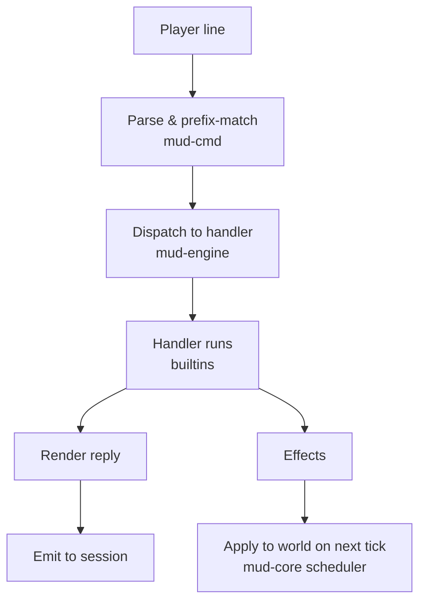

# Engine & the tick loop

This page describes, in current-state terms, how a tenant's world advances
over time and how one player input line becomes a reply and (eventually) a
world change.

## The fixed-tick scheduler

Each tenant's world advances on a fixed cadence: `TICK_HZ = 20`
(`TICK_PERIOD = 50ms`), pinned as constants in `mud-core`'s `Scheduler` and
not tenant-configurable. The `Scheduler` itself is a deterministic,
logical component — it holds a FIFO queue of `MutationCommand`s and a tick
counter, but does not own a clock. The wall-clock driver lives in `mudd`
(`world_loop.rs`), which runs a `tokio::time::interval(TICK_PERIOD)` and
calls `Scheduler::tick` on every tick.

A `MutationCommand` pairs a primitive `Effect` with an optional
`Precondition`. On each tick, `Scheduler::tick` drains the whole queue in
arrival order and, for every command, evaluates its precondition against
the current `World` at apply time: if it fails, the effect is skipped and a
`PreconditionFailed` event is emitted instead of a partial effect being
applied. Because the drain is single-threaded and strictly sequential,
per-entity serialization and last-writer-wins fall out for free — two
commands touching the same entity apply in submission order, and the
second overwrites the first.

## The command pipeline

A player input line runs through an ordered pipeline
(`mud-engine`'s `Pipeline::dispatch`):

1. **Resolve** the session to its caller (account, puppet, location).
2. **Merge** the caller's command layers into one lookup table.
3. **Parse** the line against that table (`mud-cmd`: tokenizing and
   prefix-matching against registered command names).
4. **Lock-check** the caller against the matched command's lock, if any.
5. **Dispatch** to the bound handler (`mud-engine::builtins`), which runs
   against a read-only snapshot of the world and returns a reply plus zero
   or more `Effect`s.
6. **Render** the reply immediately, in the same run, and emit it to the
   caller's session (and to any broadcast audience).

The handler's `Effect`s are *not* applied inline. The pipeline hands them
back to its caller (`mudd`'s world loop), which submits them to the
`Scheduler`; they are applied to the world on the *next* tick. So a
command's rendered reply and its world mutation are decoupled by up to one
tick — the pipeline runs once per input line, the scheduler runs once per
tick, and the two are driven independently.

Today's render step passes styled output through unflattened; the gateway
renders it to ANSI per session (see [Rendering &
color](rendering.md)).

## See also

- [Architecture overview](index.md)
