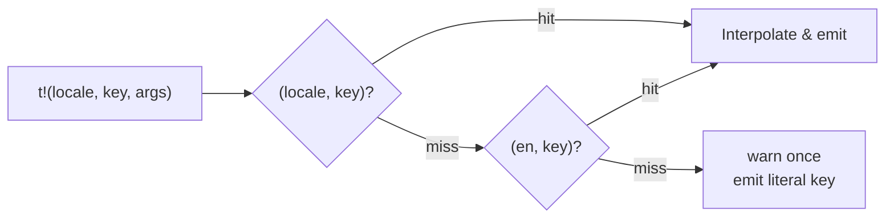

# Internationalization

Every engine-emitted player-facing string resolves through one seam — the
`t!(locale, key, args)` macro over `mud-i18n`'s `translate()` — instead of
being assembled inline as Rust string literals. A message is a single keyed
template plus named arguments, so it can be translated or reordered without
touching the call site.

## The `t!(locale, key, args)` seam

`t!` (`crates/mud-i18n/src/lib.rs`) takes a `Locale`, a `'static` key
literal, and zero or more named arguments. It parses the key into a typed
`MessageKey`, renders each argument value, and calls `translate()`
(`crates/mud-i18n/src/translate.rs`) against the process-wide built-in
catalog (`Catalog::builtin()`). Argument values are interpolated into
`{ $name }` placeholders in the resolved template.

## Resolution order

`translate()` resolves a `(locale, key)` pair in a fixed fallback order:

1. The requested `(locale, key)` — a hit renders that locale's template.
2. `(en, key)` — a locale-specific miss silently falls back to the `en`
   template. This is a normal hit, not a miss, and does **not** warn.
3. The literal key text — reached only when the key is absent from *both*
   the requested locale and `en`. This fallthrough emits a one-time
   structured `tracing::warn!`, deduplicated per `(locale, key)` for the
   life of the process, so a single misspelled key can't flood the log.

## Only `en` ships today

The built-in catalog (`crates/mud-i18n/src/catalog.rs`, `builtin_en`) holds
one locale: `en`. There is no per-tenant catalog loading — every tenant
resolves against the same static, in-memory table regardless of its
configured `locale`. Setting a tenant's `locale` to anything other than
`en` still renders correct English text via step 2 of the fallback above,
silently; nothing breaks, but no other language is actually available yet.

## See also

- [Architecture overview](index.md)
- [Building → Localization](../building/localization.md) — the
  operator/builder view of the `locale` config key and what a non-English
  setting does today.
