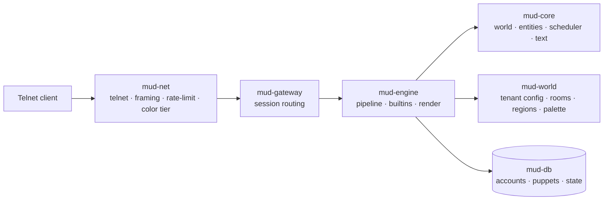

# Architecture overview

This section describes how the running Ferrodun server (`mudd`) is put
together today. It covers the runtime shape of the system, not the roadmap —
see the crate docs and `SPEC.md` for design rationale.

## Per-tenant isolated stacks

`mudd` is a multi-tenant binary: each configured tenant gets its own,
fully isolated stack — its own database, its own in-memory world, and its
own TCP listener. There is no shared database and no tenant column anywhere;
cross-tenant queries are impossible by construction. A gateway task (owning
the listener) and a world task (owning the tick loop) are bridged by an
internal channel, one pair per tenant.

## Tick-driven engine

Each tenant's world advances on a fixed 20 Hz (50 ms) tick. Player commands
are dispatched against a read-only snapshot of the world as they arrive;
their effects are queued and applied on the next tick, so the whole tenant
serializes onto a single, deterministic timeline.

## Durable state, rebuilt in memory on boot

Durable state — accounts, puppets, and world state — lives entirely in the
tenant's database. The in-memory world is not itself persisted: it is
rebuilt from the database every time the process boots. Combined with
fail-stop behavior (below), recovery from a fault is simply *restart the
process*.

## Fail-stop supervision

`mudd` does not attempt to recover from an unrecoverable error in place. A
fault in any tenant's task — a database write failure, a lost internal
channel, or a panic — ends the process rather than continuing in a
possibly-inconsistent state. Operators run `mudd` under a supervisor
(systemd, a container restart policy) that restarts it.

## Components

- **`mud-net`** — the sans-IO protocol edge: the telnet state machine,
  per-session output rendering, and rate limiting. It owns no socket; the
  gateway drives it.
- **`mud-gateway`** — accepts telnet connections and routes each session to
  its tenant's world over an internal channel.
- **`mud-engine`** — the command pipeline: resolves a session's caller,
  parses and lock-checks input, dispatches built-in command handlers, and
  renders replies.
- **`mud-core`** — the domain: the entity arena, the tick scheduler, room
  and region primitives, and styled text.
- **`mud-world`** — a tenant's authored static content: its config, rooms,
  regions, and color palette, loaded from disk.
- **`mud-db`** — persistence: one physically distinct database per tenant,
  holding accounts, puppets, and durable world state.

## See also

- [Engine & the tick loop](engine.md) — the fixed-tick scheduler and the
  command pipeline in detail.
- [Sessions & login](sessions.md) — the connection lifecycle and the login
  state machine.
- [Rendering & color](rendering.md) — how styled text is authored,
  compiled, and (not yet) delivered to a player's terminal.
