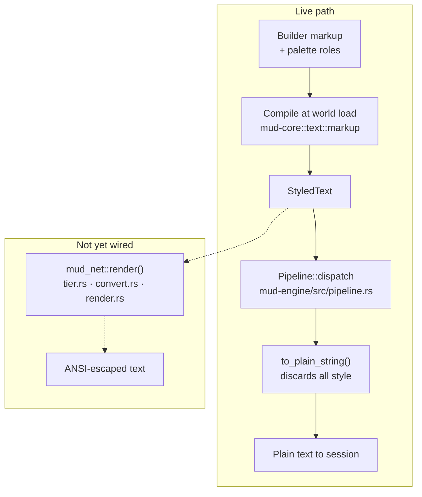

# Rendering & color

This page describes, in current-state terms, how styled text is authored and
compiled, and how (and how not) it currently reaches a player's terminal.

## Authoring & compilation — live

Builders never write terminal escape codes. Room `title` and `description`
fields accept a compact `{tag}…{/}` markup (see [Color &
styling](../building/styling.md)); at world load, `mud-core`'s markup
compiler (`mud-core/src/text/markup.rs`) parses that markup and resolves any
named color or role against the tenant's `Palette`, producing flat
`StyledText` — a sequence of spans, each carrying its own resolved style.
Malformed or unknown tags never abort loading: the inner text is kept and a
diagnostic is recorded.

The command pipeline follows the same model at runtime: a handler's reply is
assembled as `StyledText`, tagging spans with semantic roles (`error`,
`say`, `emote`, …) rather than concrete colors, so a palette override
restyles a whole category of output without touching any handler code.

## Delivery to the terminal — implemented but not yet wired

`mud-net` has a complete, unit-tested renderer for turning `StyledText` into
ANSI escapes for a session's color tier:

- **`crates/mud-net/src/tier.rs`** defines `Tier` (`Mono` / `Ansi16` /
  `Xterm256` / `Truecolor`) and `resolve_tier`, which forces `Mono` when
  `NO_COLOR` is set and otherwise falls back to the tenant default
  (`DEFAULT_TENANT_TIER = Tier::Ansi16`).
- **`crates/mud-net/src/convert.rs`** downsamples a resolved `Style` to the
  target tier's representation.
- **`crates/mud-net/src/render.rs`**'s `render()` walks a `StyledText`'s
  spans, resolves each span's role against the session's `Palette`, and
  emits the tier-appropriate escape sequence around each span's text —
  attributes (bold/italic/underline) are preserved even under `Mono`, where
  only color is dropped.

None of this is wired into the live output path. The engine's only route to
a session — `crates/mud-engine/src/pipeline.rs`'s `Pipeline::dispatch` —
flattens every reply and broadcast through `StyledText::to_plain_string()`
before sending, discarding all style information. `mud_net::render` and
`resolve_tier` currently have no
non-test caller anywhere in the workspace. As a result, **players today
receive plain text**: correct words, no color, no attributes — regardless
of their client's `NO_COLOR` setting or the tenant's configured tier.

## See also

- [Architecture overview](index.md)
- [Engine & the tick loop](engine.md) — where the render step sits in the
  command pipeline.
- [Color & styling](../building/styling.md) — the builder-facing palette and
  markup syntax.
