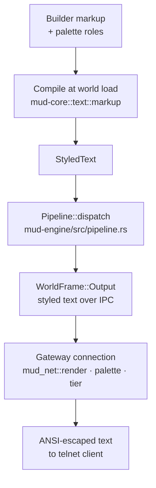

# Rendering & color

This page describes, in current-state terms, how styled text is authored and
compiled, and how (and how not) it currently reaches a player's terminal.

## Authoring & compilation — live

Builders never write terminal escape codes. Room `title` and `description`
fields accept a compact `{tag}…{/}` markup (see [Color &
styling](../building/styling.md)); at world load, `mud-core`'s markup
compiler (`mud-core/src/text/markup.rs`) parses that markup and resolves any
named color or role against the tenant's `Palette`, producing flat
`StyledText` — a sequence of spans, each carrying its own resolved style.
Malformed or unknown tags never abort loading: the inner text is kept and a
diagnostic is recorded.

The command pipeline follows the same model at runtime: a handler's reply is
assembled as `StyledText`, tagging spans with semantic roles (`error`,
`say`, `emote`, …) rather than concrete colors, so a palette override
restyles a whole category of output without touching any handler code.

## Delivery to the terminal — live

`mud-net` has a complete, unit-tested renderer for turning `StyledText` into
ANSI escapes for a session's color tier, and it is wired into the live
output path end-to-end:

- **`crates/mud-net/src/tier.rs`** defines `Tier` (`Mono` / `Ansi16` /
  `Xterm256` / `Truecolor`) and `resolve_tier`, which forces `Mono` when
  `NO_COLOR` is set and otherwise falls back to the tenant default
  (`DEFAULT_TENANT_TIER = Tier::Ansi16`). The `NO_COLOR` input is not yet
  wired to any client signal, so every live session currently calls it with
  `false`.
- **`crates/mud-net/src/convert.rs`** downsamples a resolved `Style` to the
  target tier's representation.
- **`crates/mud-net/src/render.rs`**'s `render()` walks a `StyledText`'s
  spans, resolves each span's role against the session's `Palette`, and
  emits the tier-appropriate escape sequence around each span's text —
  attributes (bold/italic/underline) are preserved even under `Mono`, where
  only color is dropped.

The engine's route to a session — `crates/mud-engine/src/pipeline.rs`'s
`Pipeline::dispatch` — passes every reply and broadcast through as
`StyledText`, unflattened. It crosses the IPC boundary inside
`WorldFrame::Output` (`OutputText` now wraps `StyledText`). The gateway's
per-connection task — the one place where escape sequences are generated —
renders it via `mud_net::render` against the tenant's `Palette` before
telnet encoding. Every session currently renders at the tenant default tier
(`ansi16`): per-session tier negotiation (TTYPE / terminal identification)
is not implemented yet, so `resolve_tier` runs with no client signal. ANSI
escapes survive the legacy-charset path too: the ASCII transliteration
applied for non-UTF-8 clients shields escape sequences and transliterates
only the text between them.

## Line discipline — live

The gateway owns how a block meets the socket: every output block is
preceded by a blank line, a completed message block is terminated with
CRLF, and a prompt block (`Password:`) is left unterminated so the cursor
rests on the prompt line. Every block is followed by one EOR/GA prompt
frame. Which treatment a block gets rides the wire as `OutputKind`
(`Line` / `Prompt`) on `SessionOutput` in `mud-schema`; the engine
classifies at the source (only the password and confirm prompts are
prompts) and coalesces the output of one input line into a single block.

## See also

- [Architecture overview](index.md)
- [Engine & the tick loop](engine.md) — where the render step sits in the
  command pipeline.
- [Color & styling](../building/styling.md) — the builder-facing palette and
  markup syntax.
