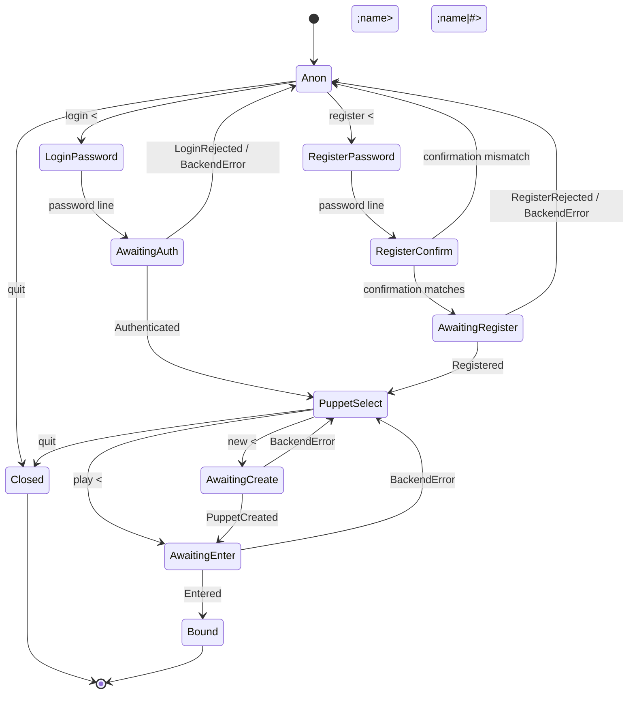

# Sessions & login

This page describes, in current-state terms, how a client goes from a raw
TCP connection to a bound, in-world session.

## Connection lifecycle

1. **TCP accept** — `mud-gateway` accepts the socket, mints a `SessionId`,
   and registers the session with the tenant's router before anything else
   can address it.
2. **Telnet negotiation** — `mud-net`'s `Negotiator` (RFC 1143 Q-method)
   opens with `DO NAWS`, `DO TTYPE`, `WILL EOR`, `WILL CHARSET`. Everything
   else, including `ECHO`, is refused with `WONT`/`DONT` — the server does
   not currently enable echo suppression, so password input arrives and is
   typed back by the client unmasked.
3. **Login FSM** — the gateway forwards each input line to the session's
   `mud-session::SessionFsm`, driven from its "World-side home" in
   `mud-engine`'s session module, which reaches accounts only through the
   injected `LoginBackend` port (backed by `mud-account`/`mud-db`).
4. **Puppet selection** — once authenticated or registered, the session
   lists the account's puppets and accepts `play <name>`, `play <number>`,
   or `new <name>`.
5. **In-world hand-off** — entering a puppet yields `Terminal::Bound`; the
   driver stops feeding input to the FSM and routes it to the command
   pipeline instead (see [Engine & the tick loop](engine.md)).

## The login FSM

`SessionFsm` (`mud-session/src/fsm.rs`) starts every connection in `Anon`
and only ever reaches the world through `PuppetSelect` → `AwaitingEnter` →
`Terminal::Bound`. A few things worth calling out:

- **Login and register failures return to `Anon`**, not to a dead end —
  `LoginRejected`, a backend fault, a mismatched registration
  confirmation, or a taken username all drop the session back to the top
  of the FSM so the player can retry.
- **Unknown user vs. bad password are indistinguishable** on the wire —
  both map to the same `LoginFailed` message, so a failed login never
  confirms whether a username exists.
- **`AwaitingAuth`, `AwaitingRegister`, `AwaitingCreate`, and
  `AwaitingEnter`** are "an effect is in flight" states: `LoginBackend`
  I/O (authenticate, register, create puppet, resolve puppet) is async, so
  the FSM parks there and ignores any input that arrives before the
  backend result comes back.
- **Creating a puppet immediately enters it** — a successful `new <name>`
  passes through `PuppetSelect` internally on its way to `AwaitingEnter`,
  but this isn't player-observable: the puppet is created and entered in
  one flow, with no extra prompt in between.

`quit` closes the connection (`Terminal::Closed`) from `Anon` or
`PuppetSelect`; it is not recognized while a password or confirmation is
being captured, since those states treat the next line as secret input
rather than a command.

## See also

- [Architecture overview](index.md)
- [Engine & the tick loop](engine.md) — what happens to input once a
  session is bound and in-world.
