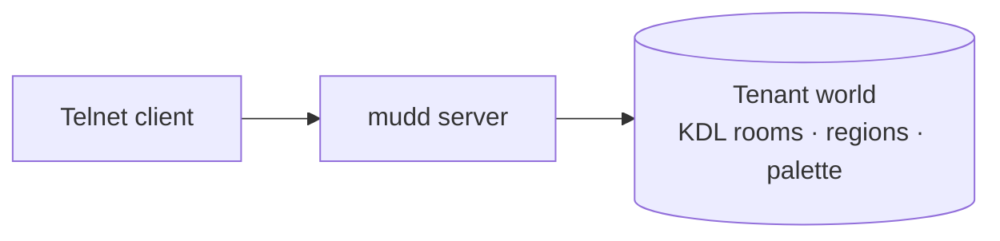

# Ferrodun

**Ferrodun is a pure-Rust MUD/MU\* engine.** A `mudd` process serves one or
more tenants over telnet, each tenant an isolated stack with its own
database and its own hand-authored world loaded from plain-text files.

See [Architecture → Overview](architecture/index.md) for the full component
breakdown.

## What works today

- **A telnet server** — `mudd` accepts telnet connections and serves one or
  more tenants, each with its own isolated database and in-memory world.
- **The built-in player command set** — login/registration, character
  selection, and in-world movement and interaction. See [Playing →
  Commands](playing/commands.md).
- **KDL-authored worlds** — rooms, exits, and regions are written as plain
  KDL files and loaded with strict, specific error reporting. See [Building →
  World files](building/world-files.md).
- **A builder-authored color palette** — room text can carry `{tag}…{/}`
  markup resolved against a tenant's palette at world-load time. This is
  currently an authoring-time feature: see [Architecture →
  Rendering](architecture/rendering.md) for why players don't currently see
  it rendered.
- **Per-tenant multi-tenancy** — each tenant is a fully isolated stack (its
  own database, its own in-memory world, its own listener); there is no
  shared state between tenants.
- **English message rendering** — all engine-emitted player-facing text
  resolves through a single, translatable message-key seam, currently
  populated with English only. See [Architecture →
  Internationalization](architecture/i18n.md).

## Where to go next

- **[Playing](playing/getting-started.md)** — connect, log in, and play.
- **[Building](building/world-files.md)** — author a tenant's world in KDL.
- **[Operating](operating/running-a-server.md)** — run and configure a
  `mudd` server.
- **[Architecture](architecture/index.md)** — how the running server is put
  together.
