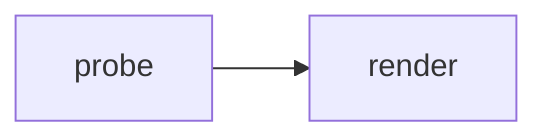
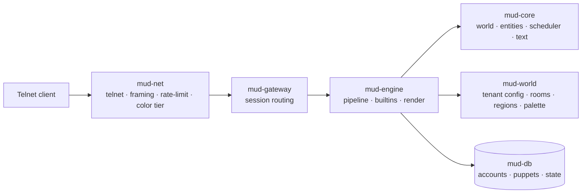
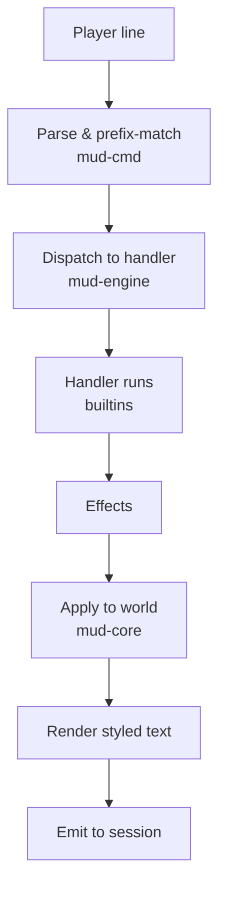
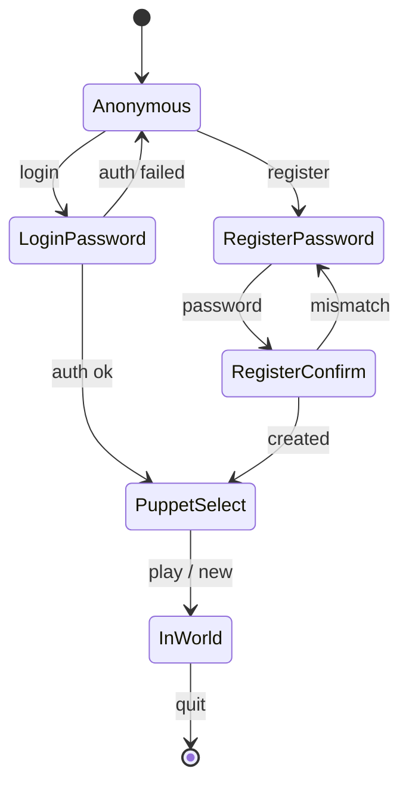
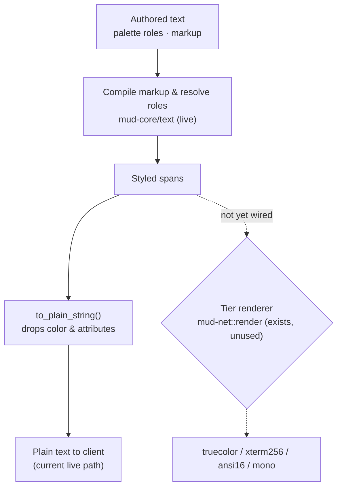
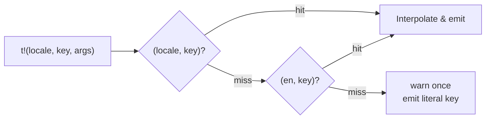

# Documentation Refactor & README Implementation Plan

> **For agentic workers:** REQUIRED SUB-SKILL: Use superpowers:subagent-driven-development (recommended) or superpowers:executing-plans to implement this plan task-by-task. Steps use checkbox (`- [ ]`) syntax for tracking.

**Goal:** Reorganize the Ferrodun documentation site into a current-state-only, persona-driven structure with a new Architecture section and Mermaid diagrams, and add a repository README.

**Architecture:** MkDocs + Material for MkDocs 9.7.6 under `docs/`, pages in `docs/docs/`, versioned with `mike`. The nav is restructured into Playing / Building / Operating / Architecture. Every factual claim is verified against the code before it ships; unimplemented features are never described. Diagrams are text-based Mermaid, rendered natively by Material.

**Tech Stack:** MkDocs, Material for MkDocs 9.7.6, Mermaid (native), uv (docs toolchain), jj (version control).

**Design spec:** `docs/superpowers/specs/2026-07-09-docs-refactor-design.md`

## Global Constraints

- **Current state only.** Describe only what the engine supports today. No roadmap, planned features, "coming soon", milestones, or development-process content anywhere on the site. Vision lives only in `README.md`.
- **Never guess.** Pin every factual claim to the named source file(s). If a claim cannot be confirmed in code, cut it.
- **Diagrams are Mermaid only.** Fenced ` ```mermaid ` blocks. No Excalidraw, no image diagrams, no new dependencies.
- **The site MUST build clean after every task.** `uv run mkdocs build --strict` from `docs/` must pass (with `--strict`, warnings such as broken internal links or pages missing from the nav are errors). Any page added/moved is reflected in `mkdocs.yml` `nav:` in the *same* commit.
- **Version control is jj.** Commit with `jj commit -m "…"`. Work in the current working copy; do not create git branches.
- **Docs pages live under `docs/docs/`.** Paths in `nav:` are relative to that directory.
- **Prose style:** accurate, concise, English. Match the existing pages' voice. Do not rewrite prose that is already correct — change only what accuracy, structure, or consistency require.

**Verified facts (already checked against code — use verbatim):**
- In-world built-in commands (`crates/mud-engine/src/builtins/mod.rs` `table()`): `look`(`l`), `inventory`(`i`,`inv`), `say`, `who`, `get`(`take`), `drop`, `north`(`n`), `east`(`e`), `south`(`s`), `west`(`w`), `up`(`u`), `down`(`d`), `quit`. There is **no** in-world `help`, `tell`, or `emote`.
- In-world `who` **is implemented** (lists connected players, sorted): `crates/mud-engine/src/builtins/session.rs`.
- Server-wide config defaults (`crates/mudd/src/config.rs`): `rate`=10, `burst`=20, listen=`127.0.0.1:4000`, `log_format`=`text`. Precedence: defaults < `config.toml` < `MUDD_*` env < CLI flags.
- Per-tenant config (`crates/mud-world/src/config.rs`): `start_room` (required), `tenant_tag` (default `0`), `locale` (default `en`), `banner` (default `welcome.kdl`), `palette` (default `palette.kdl`).
- i18n: only the English (`en`) catalog ships (`crates/mud-i18n/src/catalog.rs` `builtin_en`). Resolution order (`translate.rs`): `(locale,key)` → `(en,key)` → literal key (+ one warning per missing key). No per-tenant catalog loading exists.
- Color tiers (`crates/mud-net/src/tier.rs`, `convert.rs`): `Mono`, `Ansi16`, `Xterm256`, `Truecolor`; default tenant tier `Ansi16`.
- Telnet: server does not echo in M1; ECHO is refused (`crates/mud-net/src/telnet/negotiation.rs`). Password input is therefore not masked.

---

### Task 1: Enable Mermaid rendering in MkDocs

**Files:**
- Modify: `docs/mkdocs.yml` (the `markdown_extensions:` → `pymdownx.superfences` entry)

**Interfaces:**
- Consumes: nothing.
- Produces: a ` ```mermaid ` fenced block renders as a diagram in the built site. Later tasks rely on this.

- [ ] **Step 1: Add the Mermaid custom fence.** In `docs/mkdocs.yml`, replace the bare `- pymdownx.superfences` line with a configured form:

```yaml
  - pymdownx.superfences:
      custom_fences:
        - name: mermaid
          class: mermaid
          format: !!python/name:pymdownx.superfences.fence_code_format
```

- [ ] **Step 2: Add a temporary probe diagram.** Append to `docs/docs/index.md`:

````markdown

````

- [ ] **Step 3: Build and verify the diagram renders.**

Run: `cd docs && uv run mkdocs build --strict`
Expected: build succeeds (exit 0). Confirm `docs/site/index.html` contains `class="mermaid"` (Run: `grep -c 'class="mermaid"' docs/site/index.html` → ≥ 1).

- [ ] **Step 4: Remove the probe diagram** from `docs/docs/index.md` (index.md is fully rewritten in Task 13; leave its other content untouched here).

- [ ] **Step 5: Rebuild to confirm still clean.**

Run: `cd docs && uv run mkdocs build --strict`
Expected: build succeeds.

- [ ] **Step 6: Commit.**

```bash
jj commit -m "docs: enable Mermaid rendering via superfences custom fence"
```

---

### Task 2: Restructure the nav and relocate the operating page

**Files:**
- Modify: `docs/mkdocs.yml` (`nav:`)
- Move: `docs/docs/running-a-server.md` → `docs/docs/operating/running-a-server.md`
- Modify: `docs/docs/operating/running-a-server.md` (fix relative links after the move)

**Interfaces:**
- Consumes: nothing.
- Produces: the four-section nav skeleton (Playing / Building / Operating / Architecture). Later tasks add pages under Building/Operating/Architecture. At the end of this task only the moved page exists under Operating; new pages are added by their own tasks.

- [ ] **Step 1: Move the operating page.**

```bash
mkdir -p docs/docs/operating
jj file move docs/docs/running-a-server.md docs/docs/operating/running-a-server.md 2>/dev/null || git mv docs/docs/running-a-server.md docs/docs/operating/running-a-server.md 2>/dev/null || mv docs/docs/running-a-server.md docs/docs/operating/running-a-server.md
```

- [ ] **Step 2: Fix relative links inside the moved page.** The page previously sat at `docs/` root and linked to building pages as `building/world-files.md`. From `operating/` those become `../building/world-files.md`. Update every such link. (Run `grep -n "](building/" docs/docs/operating/running-a-server.md` to find them; prefix each with `../`.)

- [ ] **Step 3: Set the target nav.** Replace the `nav:` block in `docs/mkdocs.yml` with:

```yaml
nav:
  - Home: index.md
  - Playing:
      - Getting started: playing/getting-started.md
      - Commands: playing/commands.md
  - Building:
      - World files: building/world-files.md
      - Rooms: building/rooms.md
      - Regions: building/regions.md
      - Color & styling: building/styling.md
  - Operating:
      - Running a server: operating/running-a-server.md
  - Architecture:
      - Overview: architecture/index.md
```

Note: `architecture/index.md` does not exist yet. To keep `--strict` green, **do not add the Architecture section to the nav in this task.** Remove the `Architecture:` block for now — it is reintroduced in Task 8 when `architecture/index.md` is created. (The block is shown above only to record the final shape.)

- [ ] **Step 4: Build and verify.**

Run: `cd docs && uv run mkdocs build --strict`
Expected: build succeeds; no "not included in the nav" and no broken-link warnings.

- [ ] **Step 5: Commit.**

```bash
jj commit -m "docs: restructure nav; move running-a-server under operating/"
```

---

### Task 3: Audit the Playing pages against the command implementation

**Files:**
- Modify: `docs/docs/playing/getting-started.md`
- Modify: `docs/docs/playing/commands.md`
- Verify against: `crates/mud-engine/src/builtins/mod.rs`, `crates/mud-engine/src/builtins/session.rs`, `crates/mud-engine/src/builtins/items.rs`, `crates/mud-session/src/fsm.rs`, `crates/mud-i18n/src/catalog.rs`

**Interfaces:**
- Consumes: nothing.
- Produces: verified player-facing command reference. No structural change.

- [ ] **Step 1: Verify the pre-login command set.** Read `crates/mud-session/src/fsm.rs` and the `session.*` keys in `crates/mud-i18n/src/catalog.rs`. Confirm which commands the pre-login prompt accepts (`login`, `register`, `who`, `help`, `quit`) and whether `?` is really an alias for `help`. Confirm the puppet-selection commands (`play <name>`, `play <number>`, `new <name>`).

- [ ] **Step 2: Resolve the `who` note.** `getting-started.md` currently says pre-login `who` is "a stub — always empty." Verify against `fsm.rs` / the `session.who-stub` message whether the *pre-login* `who` is still a stub. In-world `who` is NOT a stub (it lists players — `builtins/session.rs`). Correct `getting-started.md` to describe the pre-login context accurately, and ensure `commands.md`'s in-world `who` entry says it lists connected players.

- [ ] **Step 3: Verify the in-world command table** in `commands.md` exactly matches `builtins/mod.rs` `table()`: `look`(`l`); `north`/`east`/`south`/`west`/`up`/`down` (`n`/`e`/`s`/`w`/`u`/`d`); `say`; `who`; `get`(`take`); `drop`; `inventory`(`i`,`inv`); `quit`. Remove any documented command not in the table (there is no in-world `help`, `tell`, or `emote`). Verify object disambiguation syntax (`sword.2`, `all coin`, prefix/case rules) against `builtins/items.rs`.

- [ ] **Step 4: Edit both pages** to match the verified facts. Change only what is inaccurate; keep correct prose as-is.

- [ ] **Step 5: Build and verify.**

Run: `cd docs && uv run mkdocs build --strict`
Expected: build succeeds.

- [ ] **Step 6: Commit.**

```bash
jj commit -m "docs: verify and correct Playing pages against the command set"
```

---

### Task 4: Audit the Building world-authoring pages against the loaders

**Files:**
- Modify: `docs/docs/building/world-files.md`
- Modify: `docs/docs/building/rooms.md`
- Modify: `docs/docs/building/regions.md`
- Modify: `docs/docs/building/styling.md`
- Verify against: `crates/mud-world/src/config.rs`, `crates/mud-world/src/rooms.rs`, `crates/mud-world/src/regions.rs`, `crates/mud-world/src/palette.rs`, `crates/mud-core/src/text/{markup,palette,style}.rs`

**Interfaces:**
- Consumes: nothing.
- Produces: verified builder documentation. No structural change.

- [ ] **Step 1: Verify the tenant folder layout and `config.toml` keys** in `world-files.md` against `mud-world/src/config.rs`: `start_room` (required), `banner`, `palette`, `tenant_tag`, `locale`. Note that per-tenant config has no environment-variable overrides (confirm against config.rs).

- [ ] **Step 2: Verify the room schema** in `rooms.md` against `rooms.rs`: `room "<slug>"` node; fields `title` (optional), `description` (required), `exit "<direction>" "<slug>"`; slug rules (lowercase letters/digits/`_`/`-`); the six directions; cross-file exit resolution. Confirm every stated load-time error (malformed KDL, duplicate slug, exit to unknown room, unknown direction, invalid slug, missing description, unknown field) actually exists as an error path.

- [ ] **Step 3: Verify the region rules** in `regions.md` against `regions.rs`: `region "<slug>"` with optional `name`; every room must belong to a region; no room files at `world/` root; the reserved `world/` root; one region per folder subtree (no nesting); unique region slugs. Confirm each rejection is a real error path.

- [ ] **Step 4: Verify styling** in `styling.md` against `mud-core/src/text/*` and `mud-world/src/palette.rs`: `palette.kdl`; `color "<name>" "#rrggbb"`; `role "<name>" fg=… bg=… bold/italic/underline/blink/reverse`; the baseline role set (`error`, `system`, `alert`, `prompt`, `say`, `emote`, `tell`) and the 16 named colors; field markup (`{fg=…}`, `{bg=…}`, `{b}`/`{i}`/`{u}`, `{/}`, `{{`/`}}`) and which fields allow what (`title` bold-only, `description` colors+attrs); the "unknown tag/role kept literal + warning" behavior; the builder-trusted vs player-escaped distinction. In `styling.md`, replace the inline "how color reaches each player / tiers" subsection with a one-line cross-reference to Architecture → Rendering & color (created in Task 11) — but since that page does not exist yet, keep the existing tier prose here for now and add a `TODO(cross-ref)` HTML comment; Task 11 replaces it. (Do not leave a visible TODO; use `<!-- cross-ref added in rendering task -->`.)

- [ ] **Step 5: Verify each KDL example parses.** For every ` ```kdl ` block in these four pages, confirm it conforms to the current node/field grammar in the loaders. Fix any example that would be rejected.

- [ ] **Step 6: Edit the four pages** to match verified facts; change only inaccuracies.

- [ ] **Step 7: Build and verify.**

Run: `cd docs && uv run mkdocs build --strict`
Expected: build succeeds.

- [ ] **Step 8: Commit.**

```bash
jj commit -m "docs: verify and correct Building world-authoring pages against loaders"
```

---

### Task 5: Add the Localization page (Building)

**Files:**
- Create: `docs/docs/building/localization.md`
- Modify: `docs/mkdocs.yml` (`nav:` → Building)
- Verify against: `crates/mud-world/src/config.rs`, `crates/mudd/src/boot.rs`, `crates/mud-i18n/src/catalog.rs`, `crates/mud-i18n/src/translate.rs`

**Interfaces:**
- Consumes: nothing.
- Produces: `building/localization.md`. Architecture → Internationalization (Task 12) links to it.

- [ ] **Step 1: Write the page.** Content (adapt prose; keep it honest and concise):

```markdown
# Localization

Ferrodun renders every engine message through a translation seam, so a
tenant can declare the language its messages should use. Today **only English
(`en`) is shipped**, and there is no supported way to add another language
yet — the machinery is in place, the message sets are not.

## The `locale` key

A tenant's `config.toml` may set a rendering locale:

```toml
locale = "en"   # optional; default "en"
```

The value flows into every engine-emitted line. See
[Configuration](../operating/configuration.md) for where this key sits among
the other tenant settings.

## What happens with a non-English locale

Message lookup falls back in order: the requested `(locale, key)`, then the
English `(en, key)`, then the literal key. Because only `en` message
templates exist, setting `locale = "fr"` (or any non-`en` value) resolves to
the **English** text via the fallback, and the server logs a one-time warning
per missing key. Nothing breaks; players simply see English.

For how the seam works internally, see
[Architecture → Internationalization](../architecture/i18n.md).
```

Note: the link to `../architecture/i18n.md` targets a page created in Task 12. To keep `--strict` green now, **write this page without the final Architecture link**, and add that link in Task 12 (its step explicitly does so). Include the Configuration link only if Task 6 (which creates it) has already run; if executing in order, Task 6 runs after this — so also defer the `../operating/configuration.md` link to Task 6's step, or point it at `../operating/running-a-server.md#configuration` which exists. Prefer: link to `../operating/running-a-server.md` for now; Task 6 repoints it.

- [ ] **Step 2: Add to nav.** Under `Building:` in `docs/mkdocs.yml`, add after Color & styling:

```yaml
      - Localization: building/localization.md
```

- [ ] **Step 3: Build and verify.**

Run: `cd docs && uv run mkdocs build --strict`
Expected: build succeeds; no broken-link warnings.

- [ ] **Step 4: Commit.**

```bash
jj commit -m "docs: add Localization page (English-only today, locale seam)"
```

---

### Task 6: Split Configuration into its own Operating page

**Files:**
- Create: `docs/docs/operating/configuration.md`
- Modify: `docs/docs/operating/running-a-server.md` (remove the config-reference section, link to the new page)
- Modify: `docs/docs/building/localization.md` (repoint the Configuration link)
- Modify: `docs/mkdocs.yml` (`nav:` → Operating)
- Verify against: `crates/mudd/src/config.rs`, `crates/mud-world/src/config.rs`

**Interfaces:**
- Consumes: nothing.
- Produces: `operating/configuration.md` — the single home for the full key reference.

- [ ] **Step 1: Create the Configuration page.** Move the server-wide and per-tenant configuration reference out of `running-a-server.md` into `operating/configuration.md`. Verify and include, as tables:
  - Server-wide (`mudd`): `rate` (default 10), `burst` (default 20), `log_format` (default `text`; also `--log-format`/`MUDD_LOG_FORMAT`), `[[tenants]]` registry (`dir`, `listen`). Precedence: defaults < `config.toml` < `MUDD_*` env < CLI flags. Config file location `$XDG_CONFIG_HOME/ferrodun/config.toml`; `--config` overrides; `--tenant-dir`/`--listen` single-tenant mode.
  - Per-tenant (`config.toml` in the tenant dir): `start_room` (required), `tenant_tag` (default `0`, unique across registry), `locale` (default `en` — link to [Localization](../building/localization.md)), `banner` (default `welcome.kdl`), `palette` (default `palette.kdl`).
  - Note the `MUDD_` (server-wide) vs no per-tenant env-override distinction, verified against both config.rs files.

- [ ] **Step 2: Trim `running-a-server.md`.** Leave the quickstart and the supervisor/systemd section; replace the moved configuration reference with a one-line pointer: `See [Configuration](configuration.md) for every setting.`

- [ ] **Step 3: Repoint the Localization link.** In `building/localization.md`, change the Configuration reference to `../operating/configuration.md`.

- [ ] **Step 4: Add to nav.** Under `Operating:` add after Running a server:

```yaml
      - Configuration: operating/configuration.md
```

- [ ] **Step 5: Build and verify.**

Run: `cd docs && uv run mkdocs build --strict`
Expected: build succeeds.

- [ ] **Step 6: Commit.**

```bash
jj commit -m "docs: split Configuration into its own operating page"
```

---

### Task 7: Split Logging into its own Operating page

**Files:**
- Create: `docs/docs/operating/logging.md`
- Modify: `docs/docs/operating/running-a-server.md` (remove the Logging section, link to the new page)
- Modify: `docs/mkdocs.yml` (`nav:` → Operating)
- Verify against: `crates/mudd/src/config.rs` (`LogFormat`), `docs/superpowers/specs/2026-07-08-logging-strategy-design.md`, `CLAUDE.md` "Logging"

**Interfaces:**
- Consumes: nothing.
- Produces: `operating/logging.md`.

- [ ] **Step 1: Create the Logging page.** Move the Logging section out of `running-a-server.md`. Verify and include:
  - `RUST_LOG` (standard `tracing` filter, default `info`, read from env).
  - Log format knob: `--log-format` / `MUDD_LOG_FORMAT` / `log_format` in `config.toml`; values `text` (default) or `json`; same precedence as other server config.
  - Level meanings (operator-facing): `error` = operator must act; `warn` = broken builder *content* only; `info` = boot/shutdown heartbeat (near-silent when healthy); `debug` = per-session diagnostics; `trace` = per-tick firehose. Every line is tagged with the owning `tenant`/`session` span where applicable.

- [ ] **Step 2: Trim `running-a-server.md`.** Replace the Logging section with: `See [Logging](logging.md) for levels and log format.`

- [ ] **Step 3: Add to nav.** Under `Operating:` add after Configuration:

```yaml
      - Logging: operating/logging.md
```

- [ ] **Step 4: Build and verify.**

Run: `cd docs && uv run mkdocs build --strict`
Expected: build succeeds.

- [ ] **Step 5: Commit.**

```bash
jj commit -m "docs: split Logging into its own operating page"
```

---

### Task 8: Architecture — Overview page

**Files:**
- Create: `docs/docs/architecture/index.md`
- Modify: `docs/mkdocs.yml` (`nav:` → add Architecture section)
- Verify against: workspace crates (`crates/*`), `crates/mudd/src/boot.rs`, `CLAUDE.md` "Logging" (tick rate, boundary crates)

**Interfaces:**
- Consumes: nothing.
- Produces: `architecture/index.md`, the section landing page. Tasks 9–12 add sibling pages and link back here.

- [ ] **Step 1: Write the Overview page.** Describe the runtime system as it exists today: a per-tenant stack (own database, world, listener), a tick-driven engine, durable state in the database with the in-memory world rebuilt on boot, and fail-stop supervision. No milestones or roadmap. Include this component diagram (verify crate names/roles against `crates/` before finalizing):

````markdown

````

Add links to the sibling pages: Engine & the tick loop, Sessions & login, Rendering & color, Internationalization. Since those pages do not exist yet, add each link in the task that creates the page (Tasks 9–12 each append their own back-and-forth links), OR write the list here and create all sibling pages before the next `--strict` build. Chosen approach: write the Overview *without* the sibling links now; Tasks 9–12 each add a link from Overview to themselves.

- [ ] **Step 2: Add the Architecture section to nav.**

```yaml
  - Architecture:
      - Overview: architecture/index.md
```

- [ ] **Step 3: Build and verify.**

Run: `cd docs && uv run mkdocs build --strict`
Expected: build succeeds; the component diagram renders (`grep -c 'class="mermaid"' docs/site/architecture/index.html` → ≥ 1).

- [ ] **Step 4: Commit.**

```bash
jj commit -m "docs: add Architecture overview with component diagram"
```

---

### Task 9: Architecture — Engine & the tick loop

**Files:**
- Create: `docs/docs/architecture/engine.md`
- Modify: `docs/docs/architecture/index.md` (add link to this page)
- Modify: `docs/mkdocs.yml` (`nav:`)
- Verify against: `crates/mud-core/src/scheduler.rs`, `crates/mud-cmd/`, `crates/mud-engine/src/{dispatch.rs,builtins/*}`

**Interfaces:**
- Consumes: `architecture/index.md`.
- Produces: `architecture/engine.md`.

- [ ] **Step 1: Write the page.** Describe the fixed-tick scheduler (verify the tick rate against `scheduler.rs`; `CLAUDE.md` states a 20 Hz tick — confirm) and the command pipeline. Include:

````markdown

````

- [ ] **Step 2: Link from Overview.** In `architecture/index.md`, add a link to `engine.md` (e.g. under a "See also" list).

- [ ] **Step 3: Add to nav** under Architecture, after Overview:

```yaml
      - Engine & the tick loop: architecture/engine.md
```

- [ ] **Step 4: Build and verify.**

Run: `cd docs && uv run mkdocs build --strict`
Expected: build succeeds.

- [ ] **Step 5: Commit.**

```bash
jj commit -m "docs: add Architecture engine & tick-loop page"
```

---

### Task 10: Architecture — Sessions & login

**Files:**
- Create: `docs/docs/architecture/sessions.md`
- Modify: `docs/docs/architecture/index.md` (add link)
- Modify: `docs/mkdocs.yml` (`nav:`)
- Verify against: `crates/mud-net/src/telnet/negotiation.rs`, `crates/mud-session/src/fsm.rs`, `crates/mud-account/`, `crates/mud-gateway/`

**Interfaces:**
- Consumes: `architecture/index.md`.
- Produces: `architecture/sessions.md`.

- [ ] **Step 1: Verify the FSM state names** in `crates/mud-session/src/fsm.rs` (`State` enum — confirmed variants include `LoginPassword`, `RegisterPassword`, `RegisterConfirm`, `PuppetSelect`, plus the initial and terminal states). Use the real variant names in the diagram.

- [ ] **Step 2: Write the page.** Describe the connection lifecycle: TCP accept → telnet negotiation (server does not echo in M1; ECHO refused) → login FSM → puppet selection → in-world. Include a state diagram aligned to the verified FSM (adjust node names to the real variants):

````markdown

````

- [ ] **Step 3: Link from Overview** and **add to nav** under Architecture:

```yaml
      - Sessions & login: architecture/sessions.md
```

- [ ] **Step 4: Build and verify.**

Run: `cd docs && uv run mkdocs build --strict`
Expected: build succeeds.

- [ ] **Step 5: Commit.**

```bash
jj commit -m "docs: add Architecture sessions & login page"
```

---

### Task 11: Architecture — Rendering & color

**Files:**
- Create: `docs/docs/architecture/rendering.md`
- Modify: `docs/docs/architecture/index.md` (add link)
- Modify: `docs/docs/building/styling.md` (replace the tier subsection with a cross-reference; remove the placeholder comment from Task 4)
- Modify: `docs/mkdocs.yml` (`nav:`)
- Verify against: `crates/mud-core/src/text/{markup,palette,style}.rs`, `crates/mud-net/src/tier.rs`, `crates/mud-net/src/convert.rs`

**Interfaces:**
- Consumes: `architecture/index.md`, `building/styling.md`.
- Produces: `architecture/rendering.md`.

**CURRENT-STATE REALITY (verified — must be reflected accurately).** Color/attributes are authored and compiled today but are **NOT delivered to players in the current build**: the sole live output path (`crates/mud-engine/src/pipeline.rs`, ~lines 215–217) flattens every styled message through `to_plain_string()` (test: `to_plain_string_concatenates_text_dropping_style`) before sending, so players receive plain text (correct words, no color/attributes). The ANSI/tier renderer (`crates/mud-net/src/render.rs` `render()`, `convert.rs`, `tier.rs`) is fully implemented and unit-tested but has **no non-test caller** — it is not wired into the live pipeline. Document this honestly; do NOT claim colored output reaches players today.

- [ ] **Step 1: Write the page.** Describe the render model as it exists today, in two clearly separated parts: (a) **authoring & compilation, which is live** — builder markup + palette roles are parsed and compiled into styled spans at world load, and engine output is assembled as styled text; (b) **delivery to the terminal, which is implemented but not yet wired** — the tier renderer (`mono`/`ansi16`/`xterm256`/`truecolor`; default tenant tier `ansi16`; `NO_COLOR` → mono; attributes preserved under every tier) exists in `mud-net` but is not called by the live pipeline, which currently flattens styled text to plain via `to_plain_string()`. Include a Mermaid diagram that shows the live path in solid and the not-yet-wired renderer as a separate, clearly-labelled branch:

````markdown

````

Verify the pipeline-flattening and no-caller facts against `crates/mud-engine/src/pipeline.rs` and by confirming `mud_net::render` has no non-test caller before finalizing the wording.

- [ ] **Step 2: Replace the tier subsection in styling.md with an honest note.** In `building/styling.md`, replace the "How color reaches each player / tiers" subsection (and the `<!-- cross-ref added in rendering task -->` comment left in Task 4) with a current-state admonition — NOT a claim that color reaches players. Suggested content: an `!!! note` stating that authored color and text attributes are parsed and validated today, but the current build delivers **plain text** to players; color delivery (including the per-tier downsampling) is implemented in the engine but not yet wired into the live output path. Link to `../architecture/rendering.md` for the mechanism. Do not state or imply that players currently see color.

- [ ] **Step 3: Link from Overview** and **add to nav**:

```yaml
      - Rendering & color: architecture/rendering.md
```

- [ ] **Step 4: Build and verify.**

Run: `cd docs && uv run mkdocs build --strict`
Expected: build succeeds; no broken links from styling.md.

- [ ] **Step 5: Commit.**

```bash
jj commit -m "docs: add Architecture rendering & color page; cross-ref from styling"
```

---

### Task 12: Architecture — Internationalization

**Files:**
- Create: `docs/docs/architecture/i18n.md`
- Modify: `docs/docs/architecture/index.md` (add link)
- Modify: `docs/docs/building/localization.md` (add the deferred Architecture link)
- Modify: `docs/mkdocs.yml` (`nav:`)
- Verify against: `crates/mud-i18n/src/{catalog.rs,translate.rs,locale.rs}`

**Interfaces:**
- Consumes: `architecture/index.md`, `building/localization.md`.
- Produces: `architecture/i18n.md`.

- [ ] **Step 1: Write the page.** Describe the `t!(locale, key, args)` seam and the resolution order, stating the English-only reality. Include:

````markdown

````

Note that only the `en` catalog is populated today and there is no per-tenant catalog loading. Link to [Building → Localization](../building/localization.md) for the operator/builder view.

- [ ] **Step 2: Add the deferred link in localization.md.** In `building/localization.md`, add the `../architecture/i18n.md` link that was deferred in Task 5.

- [ ] **Step 3: Link from Overview** and **add to nav**:

```yaml
      - Internationalization: architecture/i18n.md
```

- [ ] **Step 4: Build and verify.**

Run: `cd docs && uv run mkdocs build --strict`
Expected: build succeeds; all cross-links resolve.

- [ ] **Step 5: Commit.**

```bash
jj commit -m "docs: add Architecture internationalization page"
```

---

### Task 13: Rewrite the Home page to current state

**Files:**
- Modify: `docs/docs/index.md`
- Verify against: the "works today" feature set (all prior tasks' verified content)

**Interfaces:**
- Consumes: every page created above (links must resolve).
- Produces: the current-state landing page.

- [ ] **Step 1: Replace the entire page.** Remove the "Under construction" admonition and the "What it will offer" list. Write:
  - One-paragraph description: Ferrodun is a pure-Rust MUD/MU\* engine.
  - A "What works today" list, drawn only from implemented features: a telnet server; the built-in player command set; KDL-authored worlds (rooms, regions, palette); per-tenant multi-tenancy with isolated stacks; English message rendering. **Do NOT list colored/styled output as working** — color/attributes are authored and compiled but the current build delivers plain text to players (the tier renderer is not wired into the live pipeline; see Task 11's reality note). Palette/markup *authoring* may be mentioned as a builder feature, but not as something players currently see rendered in color.
  - Links into Playing, Building, Operating, and Architecture.
  - One teaser Mermaid diagram (reuse the Overview component diagram from Task 8, or a simplified `client → server → world` flow) with a link to [Architecture → Overview](architecture/index.md).

- [ ] **Step 2: Confirm no aspirational content remains.** Run `grep -niE "will offer|coming soon|later feature|under construction|roadmap|planned|not yet" docs/docs/index.md` → expect no output. (If the password-echo note or "a later feature" phrasings appear on other pages, they are addressed in Task 15's sweep.)

- [ ] **Step 3: Build and verify.**

Run: `cd docs && uv run mkdocs build --strict`
Expected: build succeeds; all links resolve; teaser diagram renders.

- [ ] **Step 4: Commit.**

```bash
jj commit -m "docs: rewrite home page to current-state landing"
```

---

### Task 14: Add the repository README

**Files:**
- Create: `README.md` (repository root)
- Verify against: `LICENSE`, `docs/` build instructions, the verified feature set

**Interfaces:**
- Consumes: nothing.
- Produces: `README.md`. Does not affect the MkDocs build.

- [ ] **Step 1: Write the README.** Concise, non-overlapping with the docs:
  - **Title + one-paragraph "What is Ferrodun"** — a pure-Rust MUD/MU\* engine.
  - **Current key features** — only what works today (mirror the home page's "works today" list, phrased for a repo reader).
  - **Vision** — a few sentences on the ambition (type-driven engine, scriptable-by-non-programmers, multi-tenant, broad client matrix), explicitly ending with: for the full roadmap see `SPEC.md` and `PLAN.md`. This is the only place vision appears in the deliverable.
  - **Quickstart pointer** — the one-line `mudd --tenant-dir /path/to/tenant` and a link to the published docs site (`https://k3rn31.github.io/ferrodun/`).
  - **Documentation** — link to the docs site; how to build docs locally (`cd docs && uv run mkdocs serve`).
  - **License** — name the license from `LICENSE` and link it.

- [ ] **Step 2: Verify links and license name.** Read `LICENSE` to state the correct license. Confirm the docs URL matches `site_url` in `docs/mkdocs.yml`.

- [ ] **Step 3: Commit.**

```bash
jj commit -m "docs: add repository README (overview, current features, vision)"
```

---

### Task 15: Final consistency sweep and verification

**Files:**
- Modify: any page needing a terminology or link fix (as found)
- Modify: `.claude/JOURNAL.md` (append an entry)

**Interfaces:**
- Consumes: the whole site.
- Produces: a consistent, verified, building site + a journal breadcrumb.

- [ ] **Step 1: Terminology sweep.** Grep for inconsistent terms and reconcile to one usage each across all pages: puppet vs character, tenant vs world, the direction set, heading case. Run e.g. `grep -rniE "puppet|character" docs/docs` and standardize per the getting-started page's established usage.

- [ ] **Step 2: Residual aspirational-content scan.** Run:

```bash
grep -rniE "will offer|coming soon|a later feature|under construction|roadmap|planned feature|not yet implemented|TODO|TBD" docs/docs
```

Expected: no hits that describe unshipped features as if present. Legitimate current-state caveats (e.g. "password input is not masked", "pre-login who is a stub") are allowed but must describe *today's* behavior, not a promise. Remove or reword anything that oversells.

- [ ] **Step 3: Full strict build + diagram check.**

Run: `cd docs && uv run mkdocs build --strict`
Expected: exit 0, zero warnings. Then confirm every architecture page rendered a diagram: `for f in index engine sessions rendering i18n; do grep -lc 'class="mermaid"' docs/site/architecture/$f/index.html || echo "MISSING diagram: $f"; done` → no MISSING lines.

- [ ] **Step 4: Link audit.** Confirm no broken internal links remain (the `--strict` build already fails on these; this is a belt-and-suspenders grep for `.md)` links that moved): `grep -rn "running-a-server.md" docs/docs` → expect only `operating/`-relative references, none pointing at the old root path.

- [ ] **Step 5: Append the journal entry** to `.claude/JOURNAL.md` (newest at bottom):

```markdown
## 2026-07-09 — Documentation refactor & README

- **Spec:** docs/superpowers/specs/2026-07-09-docs-refactor-design.md — current-state-only, persona-driven docs + README.
- **Done:** Restructured the docs nav into Playing/Building/Operating/Architecture; enabled Mermaid; verified every page against code; added Localization, Configuration, Logging, and a five-page Architecture section with Mermaid diagrams; rewrote the home page to current state; added a repository README with a small vision section.
- **Verify:** `uv run mkdocs build --strict` clean; diagrams render on every architecture page; command/config/i18n claims pinned to mud-engine/mudd/mud-world/mud-i18n.
- **Next:** none — docs track current state; keep pages current in-PR per CLAUDE.md.
```

- [ ] **Step 6: Commit.**

```bash
jj commit -m "docs: consistency sweep, final strict build, journal entry"
```

---

## Self-Review

**Spec coverage:**
- Current-state-only, no roadmap → Tasks 13 (home rewrite), 15 (aspirational scan); vision confined to README → Task 14. ✓
- Reorganized IA (Playing/Building/Operating/Architecture) → Tasks 2, 5–12. ✓
- Architecture section (5 pages) + Mermaid → Tasks 1, 8–12. ✓
- I18n honesty → Tasks 5 (Localization) + 12 (Architecture i18n). ✓
- Commands / Configuration / World building / Styling audits → Tasks 3, 4, 6, 7. ✓
- Examples verified against parsers → Task 4 Step 5; command examples → Task 3. ✓
- README → Task 14. ✓
- Clarity/consistency → Task 15. ✓

**Placeholder scan:** Content pages carry concrete outlines, verified facts, and full Mermaid sources. Audit tasks name exact source files and the specific claims to verify — no "add appropriate content". The only intentional deferral is cross-links to not-yet-created pages, each explicitly added in the creating task to keep `--strict` green.

**Type/name consistency:** Page paths are consistent across nav and links (`operating/running-a-server.md`, `building/localization.md`, `architecture/{index,engine,sessions,rendering,i18n}.md`). FSM diagram node names are flagged for verification against `fsm.rs` real variants (Task 10 Step 1) rather than asserted.

**Ordering note:** Tasks are ordered so every `--strict` build is green: Mermaid first, structure next, content pages before the home page that links them, README last. Deferred links are resolved within the task that creates their target.
