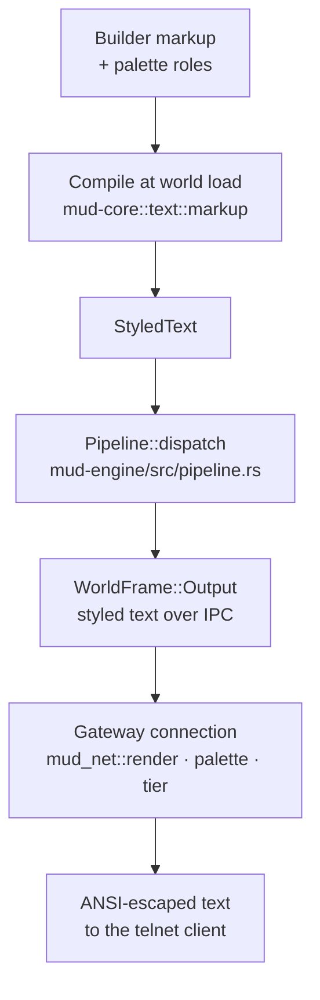

# ANSI Renderer Wiring (M1-26) Implementation Plan

> **For agentic workers:** REQUIRED SUB-SKILL: Use superpowers:subagent-driven-development (recommended) or superpowers:executing-plans to implement this plan task-by-task. Steps use checkbox (`- [ ]`) syntax for tracking.

**Goal:** Styled text crosses the IPC boundary and the gateway renders it to ANSI per session, so players see color; escapes are generated only in the per-session telnet renderer (SPEC §3.20.1.2).

**Architecture:** `mud-core`'s text model gains serde derives; `mud-schema`'s `OutputText` wraps `StyledText` instead of `String` (SCHEMA_VERSION 2→3); the engine pipeline stops flattening; the gateway connection actor calls `mud_net::render(&StyledText, &Palette, Tier)` with the tenant palette and a fixed `Ansi16` tier handed in via `GatewayConfig` from `mudd::boot`. `encode_output`'s ASCII arm learns to shield ANSI escapes from transliteration.

**Tech Stack:** Rust workspace, serde derives, postcard (existing), jj for VCS.

**Design doc:** `docs/superpowers/specs/2026-07-14-ansi-renderer-wiring-design.md`

## Global Constraints

- **VCS is jj, not git.** Commit with `jj commit -m "<msg>" <filesets>` from the repo root. Never run `git` commands.
- `unwrap()` forbidden everywhere; `expect()` allowed only in tests, with a descriptive message. No `panic!`/`todo!`/`unreachable!` in production code.
- Workspace clippy denies `unwrap_used`, `expect_used`, `print_stdout`, `print_stderr`; code must be clippy-clean: `cargo clippy --workspace --all-targets` shows no warnings. Never suppress lints.
- Add dependencies only with `cargo add` / `cargo add --dev` — never hand-edit `Cargo.toml`.
- Newtype pattern: raw primitives must not cross public APIs where a domain meaning exists.
- Logging: pure crates (`mud-core`, `mud-schema`, …) emit nothing; the gateway is a boundary crate and may log. No new logs are needed in this plan; do not add any.
- Comments explain *why*, not *how*; doc comments for all public APIs.
- After each task: `cargo test --workspace` and `cargo clippy --workspace --all-targets` must pass.
- The fixed M1 tier is `resolve_tier(false, DEFAULT_TENANT_TIER)` — do **not** wire `process_no_color()` (design §3.4 deliberately leaves the daemon-env override out).

---

### Task 1: Styled payload across IPC (`mud-core` serde + `mud-schema` swap)

**Files:**
- Modify: `crates/mud-core/Cargo.toml` (via `cargo add`)
- Modify: `crates/mud-core/src/text/color.rs:11`, `crates/mud-core/src/text/attributes.rs:15`, `crates/mud-core/src/text/style.rs:11,82,133`, `crates/mud-core/src/text/span.rs:10,56`
- Modify: `crates/mud-schema/Cargo.toml` (via `cargo add`)
- Modify: `crates/mud-schema/src/frame.rs` (`OutputText`, doc comments, new test)
- Modify: `crates/mud-schema/src/session.rs:76,140` (SCHEMA_VERSION 2→3)
- Modify: `crates/mud-gateway/src/connection.rs:131`, `crates/mud-gateway/src/router.rs:178,345,400` (compile fallout)
- Modify: `crates/mud-engine/src/session/mod.rs:420,429,651-652` (compile fallout in tests)

**Interfaces:**
- Consumes: `mud_core::StyledText` (existing: `spans()`, `to_plain_string()`, `From<&str>`, `From<String>`).
- Produces (later tasks rely on these exact signatures):
  - `OutputText::new(text: impl Into<StyledText>) -> OutputText` — existing string call sites keep compiling via the `From` impls.
  - `OutputText::styled(&self) -> &StyledText`
  - `OutputText::to_plain_string(&self) -> String`
  - Serde `Serialize`/`Deserialize` on `Color`, `Attributes`, `Style`, `RoleName`, `SpanStyle`, `Span`, `StyledText`.

- [ ] **Step 1: Write the failing test**

In `crates/mud-schema/src/frame.rs`, add to the tests module, next to `world_output_round_trips` (frame.rs:236):

```rust
#[test]
fn world_output_round_trips_styled_text() {
    let styled = mud_core::StyledText::new()
        .role("Alice", mud_core::RoleName::SAY)
        .plain(" waves");
    let frame = WorldFrame::Output(SessionOutput {
        session_id: session(9),
        text: OutputText::new(styled),
    });
    let bytes = encode(&frame).expect("encode");
    assert_eq!(decode::<WorldFrame>(&bytes).expect("decode"), frame);
}
```

- [ ] **Step 2: Run test to verify it fails**

Run: `cargo test -p mud-schema world_output_round_trips_styled_text`
Expected: FAIL to compile — `mud_core` is not a dependency and `OutputText::new` takes a string.

- [ ] **Step 3: Add the dependencies**

```bash
cargo add serde --features derive --package mud-core
cargo add mud-core --path crates/mud-core --package mud-schema
```

- [ ] **Step 4: Derive serde on the text model**

Add `serde::Serialize, serde::Deserialize` to the existing derive lists (do not change any other derive). The types and their current derive lines:

```rust
// color.rs:11
#[derive(Debug, Clone, Copy, PartialEq, Eq, Hash, serde::Serialize, serde::Deserialize)]
pub struct Color { ... }

// attributes.rs:15
#[derive(Debug, Clone, Copy, PartialEq, Eq, Hash, Default, serde::Serialize, serde::Deserialize)]
pub struct Attributes(u8);

// style.rs:11 (Style), style.rs:82 (RoleName), style.rs:133 (SpanStyle)
#[derive(Debug, Clone, Copy, PartialEq, Eq, Hash, Default, serde::Serialize, serde::Deserialize)]
pub struct Style { ... }
#[derive(Debug, Clone, PartialEq, Eq, Hash, serde::Serialize, serde::Deserialize)]
pub struct RoleName(Cow<'static, str>);
#[derive(Debug, Clone, PartialEq, Eq, serde::Serialize, serde::Deserialize)]
pub enum SpanStyle { ... }

// span.rs:10 (Span), span.rs:56 (StyledText)
#[derive(Debug, Clone, PartialEq, Eq, serde::Serialize, serde::Deserialize)]
pub struct Span { ... }
#[derive(Debug, Clone, PartialEq, Eq, Default, serde::Serialize, serde::Deserialize)]
pub struct StyledText { ... }
```

Note: `RoleName`'s `Cow<'static, str>` deserializes to the `Owned` variant under serde's stock impl — equality and hashing compare string contents (see the type's doc comment), so a round-tripped baseline constant still matches. No serde attributes needed.

- [ ] **Step 5: Swap the `OutputText` payload**

In `crates/mud-schema/src/frame.rs`, replace the `OutputText` definition (frame.rs:35-56) with:

```rust
use mud_core::StyledText;

/// Styled text rendered by the World for presentation to one client.
///
/// Carries the transport-neutral styled-text model (§3.20.1.1) across the IPC
/// boundary; ANSI escape generation happens only in the Gateway's per-session
/// telnet renderer (§3.20.1.2, wired in M1-26).
#[derive(Debug, Clone, PartialEq, Eq, Serialize, Deserialize)]
#[must_use]
pub struct OutputText(StyledText);

impl OutputText {
    /// Wraps styled output text. Plain strings convert via
    /// `StyledText`'s `From` impls, entering as a single unstyled span.
    pub fn new(text: impl Into<StyledText>) -> Self {
        Self(text.into())
    }

    /// The styled text destined for the session's renderer.
    pub fn styled(&self) -> &StyledText {
        &self.0
    }

    /// The plain-text projection, for logging and assertions where only the
    /// characters matter.
    #[must_use]
    pub fn to_plain_string(&self) -> String {
        self.0.to_plain_string()
    }
}
```

Also update the `SessionOutput` doc comment (frame.rs:68-73): delete the two sentences about the payload swap being deferred to M1-21/M1-22 — the swap has landed; keep the "Rendered output destined for one client session" line and note the schema is version-locked (§2.8.5.7).

- [ ] **Step 6: Bump SCHEMA_VERSION**

In `crates/mud-schema/src/session.rs:76`, change `SchemaVersion(2)` to `SchemaVersion(3)`; update the assertion at session.rs:140 from `2` to `3`.

- [ ] **Step 7: Fix compile fallout (behavior-preserving)**

- `crates/mud-gateway/src/connection.rs:131`: `machine.encode_output(text.as_str())` → `machine.encode_output(&text.to_plain_string())` (interim — Task 4 replaces this with the real render call).
- `crates/mud-gateway/src/router.rs` tests: `text.as_str() == "hello"` → `text.to_plain_string() == "hello"` (same for `"b-marker"` at :345 and `"for-a"` at :400).
- `crates/mud-engine/src/session/mod.rs` tests: `o.text.as_str()` → `o.text.to_plain_string()` at :420 and :651-652 (adjust `text_of` to `map(|o| o.text.to_plain_string())`), and `text.text.as_str()` → `text.text.to_plain_string()` at :429 (`login_text_of` collects `String`s; change the `Vec<_>` element type accordingly — `filter_map(...).collect::<Vec<_>>().join("\n")` works unchanged with `String` items).

- [ ] **Step 8: Run tests and clippy**

Run: `cargo test --workspace && cargo clippy --workspace --all-targets`
Expected: all green, including the new round-trip test. Behavior is unchanged end-to-end: every producer still feeds plain strings, every consumer still gets the plain projection.

- [ ] **Step 9: Commit**

```bash
jj commit -m "feat(schema): styled text crosses the IPC boundary (M1-26)" crates/mud-core crates/mud-schema crates/mud-gateway crates/mud-engine Cargo.lock
```

---

### Task 2: Pipeline passes styled text through (`mud-engine`)

**Files:**
- Modify: `crates/mud-engine/src/pipeline.rs:200-253` (`run_matched`, `message`)
- Test: `crates/mud-engine/src/session/mod.rs` (extend the existing say-broadcast test, ~line 600-655)

**Interfaces:**
- Consumes: `OutputText::new(impl Into<StyledText>)` and `OutputText::styled()` from Task 1; `CommandReply::output() -> &StyledText` and `broadcast.message() -> &StyledText` (existing).
- Produces: `SessionOutput.text` now preserves role spans end-to-end through `Pipeline::dispatch`. Helper signature becomes `fn message(session_id: mud_schema::SessionId, text: impl Into<mud_core::StyledText>) -> Vec<SessionOutput>`.

- [ ] **Step 1: Extend the broadcast test to assert styled payloads (failing)**

In the existing test in `crates/mud-engine/src/session/mod.rs` that dispatches `say hi` and asserts "the second session must receive the broadcast" (ends at :655), add after the existing assertion:

```rust
// The styled payload must survive to the frame: the renderer (gateway side)
// resolves the SAY role against the palette (§3.20.4.2).
let has_say_role = |o: &mud_schema::SessionOutput| {
    o.text.styled().spans().iter().any(
        |s| matches!(s.style(), mud_core::SpanStyle::Role(r) if *r == mud_core::RoleName::SAY),
    )
};
assert!(
    outcome.outputs.iter().any(|o| o.session_id == sid(2) && has_say_role(o)),
    "the broadcast must carry the say role span",
);
assert!(
    outcome.outputs.iter().any(|o| o.session_id == sid(1) && has_say_role(o)),
    "the caller reply must carry the say role span",
);
```

- [ ] **Step 2: Run test to verify it fails**

Run: `cargo test -p mud-engine -- say`
Expected: FAIL — the pipeline still flattens, so every span is `SpanStyle::Plain`.

- [ ] **Step 3: Stop flattening in the pipeline**

In `crates/mud-engine/src/pipeline.rs`:

- Change the `message` helper (pipeline.rs:247-253) to:

```rust
/// Wraps one engine message as a single-element output for `session_id`.
fn message(
    session_id: mud_schema::SessionId,
    text: impl Into<mud_core::StyledText>,
) -> Vec<SessionOutput> {
    vec![SessionOutput {
        session_id,
        text: OutputText::new(text),
    }]
}
```

(The `t!(...)` string call sites at pipeline.rs:180-183 and :191-194 keep compiling via `From<String> for StyledText`.)

- Replace the flattening (pipeline.rs:212-229) with:

```rust
// Caller reply first, then fan out each broadcast to the other sessions
// in its audience — all resolved against the pre-effect world, before the
// reply's own effects apply. Styled text passes through untouched; the
// gateway renders it per session (§3.20.1.2).
let mut outputs = message(session_id, reply.output().clone());
for broadcast in reply.broadcasts() {
    let styled = broadcast.message().clone();
    for occupant in world.occupants_of(broadcast.place()) {
        if occupant == broadcast.except() {
            continue;
        }
        if let Some(recipient) = roster.session_of(occupant) {
            outputs.push(SessionOutput {
                session_id: recipient,
                text: OutputText::new(styled.clone()),
            });
        }
    }
}
```

- [ ] **Step 4: Run tests and clippy**

Run: `cargo test --workspace && cargo clippy --workspace --all-targets`
Expected: all green, including the extended say test.

- [ ] **Step 5: Commit**

```bash
jj commit -m "feat(engine): pipeline passes styled text through unflattened (M1-26)" crates/mud-engine
```

---

### Task 3: Shield ANSI escapes from ASCII transliteration (`mud-net`)

**Files:**
- Modify: `crates/mud-net/src/telnet/mod.rs:120-145` (`encode_output` ASCII arm + two private helpers + tests)

**Interfaces:**
- Consumes: nothing new.
- Produces: `encode_output` (signature unchanged: `pub fn encode_output(&self, text: &str) -> Vec<u8>`) now passes ANSI CSI sequences through the ASCII-transliteration path intact.

- [ ] **Step 1: Write the failing test**

In `crates/mud-net/src/telnet/mod.rs` tests, next to `legacy_client_gets_ascii_transliteration`:

```rust
#[test]
fn ascii_transliteration_preserves_ansi_escapes() {
    let machine = TelnetMachine::new(); // CHARSET never accepted → ASCII mode
    assert_eq!(
        machine.encode_output("\u{1b}[97mcafé\u{1b}[0m\n"),
        b"\x1b[97mcafe\x1b[0m\r\n".to_vec()
    );
}
```

- [ ] **Step 2: Run test to verify it fails**

Run: `cargo test -p mud-net ascii_transliteration_preserves_ansi_escapes`
Expected: FAIL — deunicode maps the ESC control byte to nothing, leaving `[97mcafe[0m\r\n`.

- [ ] **Step 3: Implement escape-aware transliteration**

In `crates/mud-net/src/telnet/mod.rs`, replace the `CharsetMode::Ascii` arm of `encode_output` (mod.rs:126-131) with:

```rust
CharsetMode::Ascii => std::borrow::Cow::Owned(transliterate_preserving_escapes(text)),
```

and add these private functions (module level, near `encode_output`):

```rust
/// Transliterates to ASCII while passing ANSI escape sequences through
/// untouched. deunicode maps control bytes to nothing, so an SGR prefix
/// would otherwise lose its ESC and leak "[97m" as visible text — and a
/// legacy-charset client very likely still supports ANSI color.
fn transliterate_preserving_escapes(text: &str) -> String {
    let mut out = String::with_capacity(text.len());
    let mut rest = text;
    while let Some(start) = rest.find('\u{1b}') {
        // INVARIANT: `start` indexes the one-byte ESC char and `escape_len`
        // ends just past an ASCII byte, so both splits are char-boundary safe.
        let (plain, from_esc) = rest.split_at(start);
        out.push_str(&transliterate_plain(plain));
        let (escape, tail) = from_esc.split_at(escape_len(from_esc));
        out.push_str(escape);
        rest = tail;
    }
    out.push_str(&transliterate_plain(rest));
    out
}

/// The length in bytes of the escape sequence at the start of `s` (which
/// begins with ESC): a CSI sequence runs through its final byte
/// (`0x40..=0x7e`); a lone ESC not opening a CSI passes through as one byte.
fn escape_len(s: &str) -> usize {
    let bytes = s.as_bytes();
    if bytes.get(1) != Some(&b'[') {
        return 1;
    }
    bytes
        .iter()
        .skip(2)
        .position(|byte| (0x40..=0x7e).contains(byte))
        .map_or(bytes.len(), |i| i + 3)
}

/// deunicode maps control bytes to "" once it hits its transliteration path,
/// so '\n' must be shielded from it by transliterating line-by-line.
fn transliterate_plain(text: &str) -> String {
    text.split('\n')
        .map(deunicode::deunicode)
        .collect::<Vec<_>>()
        .join("\n")
}
```

(The line-by-line `'\n'` shielding moves from the old arm into `transliterate_plain`; delete the old comment at its former site.)

- [ ] **Step 4: Run tests and clippy**

Run: `cargo test -p mud-net && cargo clippy --workspace --all-targets`
Expected: all green — the existing `legacy_client_gets_ascii_transliteration` and `utf8_client_gets_utf8_passthrough` tests still pass.

- [ ] **Step 5: Commit**

```bash
jj commit -m "fix(net): shield ANSI escapes from ASCII transliteration (M1-26)" crates/mud-net
```

---

### Task 4: Gateway renders per session (`mud-gateway`)

**Files:**
- Modify: `crates/mud-gateway/Cargo.toml` (via `cargo add`)
- Modify: `crates/mud-gateway/src/config.rs`
- Modify: `crates/mud-gateway/src/lib.rs:56-91` (`serve` threads palette/tier into connections)
- Modify: `crates/mud-gateway/src/connection.rs` (`run_connection`, `connection_loop`, Output arm, unit tests)
- Test: `crates/mud-gateway/tests/loopback.rs` (`config()` helper + new e2e test)

**Interfaces:**
- Consumes: `OutputText::styled()` (Task 1); `mud_net::render(&StyledText, &Palette, Tier) -> String`, `mud_net::Tier` (existing); `mud_core::Palette::baseline()` (existing).
- Produces: `GatewayConfig` gains fields `pub palette: std::sync::Arc<mud_core::Palette>` and `pub tier: mud_net::Tier`, and **loses `Copy`** (keeps `Clone`). `run_connection` gains trailing parameters `palette: Arc<Palette>, tier: Tier`. Task 5 constructs the new fields in `mudd::boot`.

- [ ] **Step 1: Write the failing loopback test**

In `crates/mud-gateway/tests/loopback.rs`, extend `config()` (loopback.rs:25-31) and add a test:

```rust
use std::sync::Arc;
use mud_core::{Palette, RoleName, StyledText};
use mud_net::Tier;

fn config() -> GatewayConfig {
    GatewayConfig {
        world_id: world_id(),
        rate: SustainedRate::DEFAULT,
        burst: Burst::DEFAULT,
        palette: Arc::new(Palette::baseline()),
        tier: Tier::Ansi16,
    }
}

/// The M1-26 wiring assertion: a styled World frame reaches the client as
/// ansi16 SGR bytes — the piece M1-23's "assert ANSI" clause leans on.
#[tokio::test]
async fn styled_output_renders_ansi16_sgr_to_the_client() {
    let (addr, mut world_end) = boot_gateway(config()).await;
    let mut client = TcpStream::connect(addr).await.expect("client connects");
    let session_id = expect_connect(&mut world_end).await;

    let styled = StyledText::new()
        .role("Alice", RoleName::SAY)
        .plain(" waves\n");
    world_end
        .send(WorldFrame::Output(SessionOutput {
            session_id,
            text: OutputText::new(styled),
        }))
        .await
        .expect("world sends styled output");

    let bytes = read_until(&mut client, b"waves").await;
    // Baseline SAY (#cdd6f4) downsamples to bright white (SGR 97) at ansi16 —
    // pinned by mud-net's ansi16_render_is_stable snapshot test.
    let sgr = b"\x1b[97mAlice\x1b[0m";
    assert!(
        bytes.windows(sgr.len()).any(|w| w == sgr),
        "expected ansi16 SGR around the say span, got {bytes:?}"
    );
}
```

- [ ] **Step 2: Run test to verify it fails**

Run: `cargo test -p mud-gateway --test loopback`
Expected: FAIL to compile — `GatewayConfig` has no `palette`/`tier` fields yet.

- [ ] **Step 3: Add the dependency and the config fields**

```bash
cargo add mud-core --path crates/mud-core --package mud-gateway
```

Replace `crates/mud-gateway/src/config.rs` content with:

```rust
//! Gateway runtime configuration.

use std::sync::Arc;

use mud_core::Palette;
use mud_net::{Burst, SustainedRate, Tier};
use mud_schema::WorldId;

/// Configuration for one [`serve`](crate::serve) run.
///
/// Values come from tenant configuration; this crate does no config loading
/// (that is `mudd`'s job, M1-22).
#[derive(Debug, Clone)]
#[must_use]
pub struct GatewayConfig {
    /// The World this gateway's IPC channel addresses (§2.1.3.2).
    pub world_id: WorldId,
    /// Per-session sustained command rate (§2.1.1; default 10/s).
    pub rate: SustainedRate,
    /// Per-session command burst allowance (§2.1.1; default 20).
    pub burst: Burst,
    /// The tenant palette session roles resolve against at render time
    /// (§3.20.3); shared read-only across connections.
    pub palette: Arc<Palette>,
    /// The color tier every session renders at. Fixed per gateway until
    /// per-session terminal negotiation lands (§3.20.5.2 step 3, M3).
    pub tier: Tier,
}
```

(`Copy` is dropped because `Arc` is not `Copy`; `serve` only reads `Copy` fields per accept iteration and clones the `Arc`, so no caller needs `Copy`.)

- [ ] **Step 4: Thread palette/tier into the connection and render**

In `crates/mud-gateway/src/lib.rs` (`serve`, lib.rs:87), pass the new state to each connection:

```rust
tokio::spawn(
    run_connection(
        socket,
        session_id,
        to_router.clone(),
        limiter,
        config.palette.clone(),
        config.tier,
    )
    .instrument(span),
);
```

In `crates/mud-gateway/src/connection.rs`:

- `run_connection` gains trailing parameters `palette: std::sync::Arc<mud_core::Palette>, tier: mud_net::Tier` and forwards `&palette, tier` to `connection_loop` (which gains matching `palette: &mud_core::Palette, tier: mud_net::Tier` parameters).
- The Output arm (connection.rs:130-137) becomes:

```rust
Some(ToConnection::Output(text)) => {
    // The one place escapes are generated (§3.20.1.2): render the
    // styled payload for this session, then encode per its charset.
    let ansi = mud_net::render(text.styled(), palette, tier);
    let mut bytes = machine.encode_output(&ansi);
    // One rendered block = one prompt frame (§2.8.2 EOR/GA).
    bytes.extend_from_slice(&machine.prompt_frame());
    if writer.write_all(&bytes).await.is_err() {
        return ExitCause::ClientGone;
    }
}
```

- Update `connection.rs`'s unit tests: every `run_connection(...)` call gains `Arc::new(mud_core::Palette::baseline()), mud_net::Tier::Ansi16` as the new trailing arguments. Their plain `"hello\n"` payloads render escape-free, so existing byte assertions are unchanged.

- [ ] **Step 5: Fix `mudd::boot` in the same task and run everything**

`mudd::boot` constructs `GatewayConfig`, so it must gain the new fields now to keep the tree green. Apply the exact `gateway_config` code from Task 5 Step 1 to `crates/mudd/src/boot.rs` (including the `use mud_net::{DEFAULT_TENANT_TIER, resolve_tier};` import), then:

Run: `cargo test --workspace && cargo clippy --workspace --all-targets`
Expected: all green, including the new loopback test.

- [ ] **Step 6: Commit**

```bash
jj commit -m "feat(gateway): render styled output per session at ansi16 (M1-26)" crates/mud-gateway crates/mudd Cargo.lock
```

---

### Task 5: `mudd` e2e — color reaches a real telnet client

**Files:**
- Modify: `crates/mudd/src/boot.rs:76-80` (done minimally in Task 4 Step 5; verify it matches below)
- Test: `crates/mudd/tests/telnet_login.rs` (~line 156, the `look` exchange)

**Interfaces:**
- Consumes: `GatewayConfig { palette, tier, .. }` (Task 4); `LoadedWorld::palette() -> &Palette`, `mud_net::{resolve_tier, DEFAULT_TENANT_TIER}` (existing).
- Produces: nothing new — this task pins end-to-end behavior.

- [ ] **Step 1: Verify the boot wiring**

`crates/mudd/src/boot.rs` must construct (with `use mud_net::{DEFAULT_TENANT_TIER, resolve_tier};` added to the imports):

```rust
let gateway_config = GatewayConfig {
    world_id,
    rate: config.rate,
    burst: config.burst,
    palette: Arc::new(loaded.palette().clone()),
    tier: resolve_tier(false, DEFAULT_TENANT_TIER),
};
```

`resolve_tier(false, ..)` is deliberate: the client-signalled NO_COLOR (§3.20.5.2 step 2) arrives with M3 terminal negotiation, and the daemon-env `process_no_color()` is out of scope by design (design doc §3.4). M3 replaces this call site.

- [ ] **Step 2: Write the failing e2e assertion**

In `crates/mudd/tests/telnet_login.rs`, the registration test sends `look` and reads to `b"Town Square"` (~line 156). Capture and assert:

```rust
client.write_line("look").await;
let look_reply = client.read_until(b"Town Square").await;
// M1-26: the reply must carry ANSI escapes — the room title/exits are
// styled, and the gateway now renders at ansi16.
assert!(
    look_reply.windows(2).any(|w| w == b"\x1b["),
    "look reply must contain ANSI escapes, got {look_reply:?}"
);
```

- [ ] **Step 3: Run the e2e test**

Run: `cargo test -p mudd --test telnet_login`
Expected: PASS — the wiring went live in Task 4, so this assertion pins existing behavior rather than driving new code (the red half of this task's TDD cycle happened in Task 4's loopback test). If it fails, the boot wiring is broken — debug before proceeding; do not weaken the assertion.

Note: the surrounding login prompts stay escape-free (login output is unstyled by design), so the existing `read_until(b"Password:")` style needles are unaffected; `read_until(b"Town Square")` still matches because SGR bytes never split a span's text.

- [ ] **Step 4: Run the full workspace**

Run: `cargo test --workspace && cargo clippy --workspace --all-targets`
Expected: all green.

- [ ] **Step 5: Commit**

```bash
jj commit -m "test(mudd): e2e asserts ANSI color reaches the telnet client (M1-26)" crates/mudd
```

---

### Task 6: PLAN.md, docs site, journal

**Files:**
- Modify: `PLAN.md:427` (stale pointer), after the M1-25 entry (~line 682, new M1-26 entry)
- Modify: `docs/docs/architecture/rendering.md` (the "Delivery to the terminal" section + mermaid)
- Modify: `docs/docs/architecture/engine.md:50-51`
- Modify: `docs/docs/building/styling.md:83-93` (the "Color is not delivered to players yet" admonition)
- Modify: `.claude/JOURNAL.md` (append entry)

**Interfaces:** none — documentation only.

- [ ] **Step 1: Fix the stale PLAN pointer**

In `PLAN.md:427`, change:

```
    the IPC `OutputText`→styled-text swap (M1-21/M1-22, where the renderer is
    wired into the session pipeline); player-input markup escaping (§3.20.7 →
```

to:

```
    the IPC `OutputText`→styled-text swap (M1-26, where the renderer is
    wired into the session pipeline); player-input markup escaping (§3.20.7 →
```

- [ ] **Step 2: Add the M1-26 entry**

In `PLAN.md`, immediately after the M1-25 entry (its `*Verify:*` block ends just before the `---` / `## M2` heading), insert:

```markdown
- **M1-26 — ANSI renderer wiring.** Styled text crosses the IPC boundary
  (`OutputText` wraps `StyledText`, `SCHEMA_VERSION` 2→3, serde on the
  `mud-core` text model) and the gateway connection actor renders it per
  session via `mud_net::render` against the tenant palette, at the fixed M1
  tier `resolve_tier(false, DEFAULT_TENANT_TIER)` → `ansi16` (TTYPE/MTTS
  negotiation replaces that call site in M3). `encode_output`'s ASCII
  transliteration shields ANSI escapes so legacy-charset clients keep color.
  The M1-23 gate's "assert ANSI" clause depends on this PR.
  - *Spec:* §3.20.1.2, §3.20.5; design doc
    `docs/superpowers/specs/2026-07-14-ansi-renderer-wiring-design.md`.
    *Verify:* gateway loopback asserts ansi16 SGR bytes at the client; `mudd`
    telnet e2e asserts escapes in the `look` reply; workspace tests and
    clippy green.
```

- [ ] **Step 3: Update `docs/docs/architecture/rendering.md`**

Rewrite the section heading `## Delivery to the terminal — implemented but not yet wired` as `## Delivery to the terminal — live` and replace the paragraph beginning "None of this is wired into the live output path." (and everything through the end of the mermaid diagram) with:

````markdown
The live output path uses this renderer end-to-end. The engine pipeline
(`crates/mud-engine/src/pipeline.rs`) passes each reply and broadcast through
as `StyledText`; it crosses the IPC boundary inside `WorldFrame::Output`
(`OutputText` wraps `StyledText`); and the gateway's per-connection task —
the one place escape sequences are generated — renders it with
`mud_net::render` against the tenant palette before telnet encoding. Every
session currently renders at the tenant default tier (`ansi16`): per-session
tier negotiation (TTYPE / terminal identification) is not implemented yet,
so `resolve_tier` runs with no client signal. ANSI escapes survive the
legacy-charset path: ASCII transliteration for non-UTF-8 clients shields
escape sequences and transliterates only the text between them.


````

Keep the rest of the page intact; scan it for any other "not wired" phrasing and align it.

- [ ] **Step 4: Update `docs/docs/architecture/engine.md:50-51`**

Replace the sentence "Today's render step flattens styled output to plain text (`StyledText::to_plain_string()`) before it is emitted to the session — no …" with:

```markdown
The render step passes styled output through unflattened; the gateway
renders it to ANSI per session (see
[Rendering & color](rendering.md)).
```

(Adapt the surrounding sentence so it reads naturally in context.)

- [ ] **Step 5: Update `docs/docs/building/styling.md:83-93`**

Replace the `!!! note "Color is not delivered to players yet"` admonition with:

```markdown
!!! note "Color renders at 16-color ANSI for now"

    Styled output reaches players' telnet clients as real ANSI color. Every
    session currently renders at the `ansi16` tier — truecolor authoring is
    downsampled to the 16 standard colors deterministically. Per-client tier
    detection (256-color / truecolor upgrades) is not implemented yet.
```

- [ ] **Step 6: Build the docs strictly**

Run: `cd docs && uv run mkdocs build --strict && cd ..`
Expected: build succeeds with no warnings.

- [ ] **Step 7: Append the journal entry**

Append to `.claude/JOURNAL.md`:

```markdown
## 2026-07-14 — ANSI renderer wiring (M1-26)

- **Spec:** §3.20.1.2, §3.20.5 — escapes generated only in the per-session
  telnet renderer; styled text over internal pipelines.
- **Done:** serde on the mud-core text model; `OutputText` wraps `StyledText`
  (SCHEMA_VERSION 3); pipeline passes styled text through; gateway renders per
  session at ansi16 (`GatewayConfig` gains palette + tier from boot);
  `encode_output` ASCII transliteration shields ANSI escapes; PLAN M1-26 added,
  stale M1-21/22 pointer fixed; docs (rendering/engine/styling) updated.
- **Verify:** gateway loopback asserts ansi16 SGR at the client; mudd telnet
  e2e asserts escapes in the `look` reply; workspace tests + clippy green;
  mkdocs --strict green.
- **Next:** M1-23 acceptance integration test (its "assert ANSI" clause now
  has the wiring it needs). Tier negotiation → M3.
```

- [ ] **Step 8: Commit**

```bash
jj commit -m "docs: PLAN M1-26 + current-state color docs (M1-26)" PLAN.md docs .claude/JOURNAL.md
```
